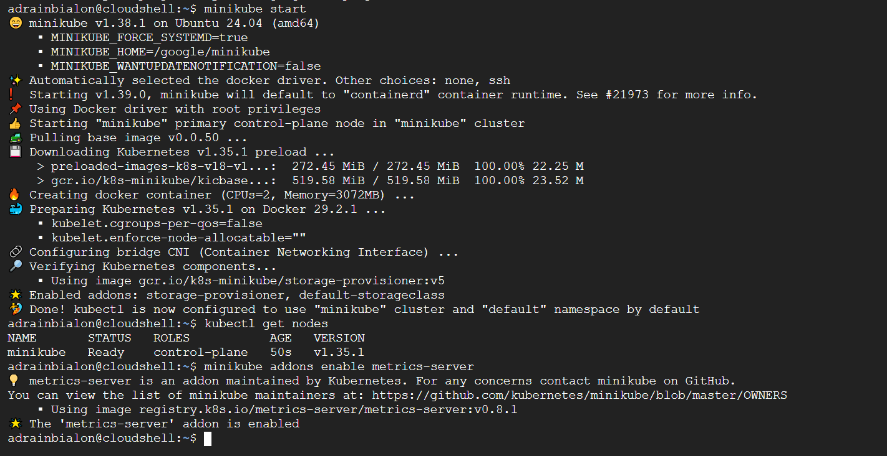
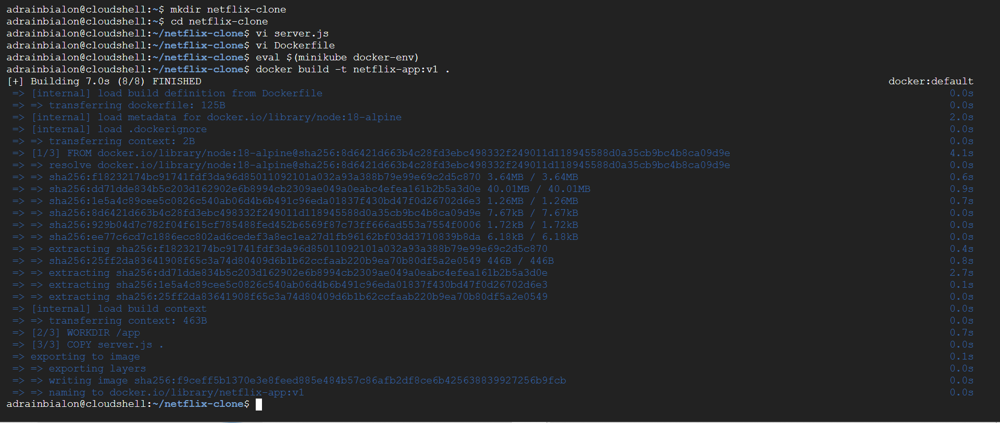
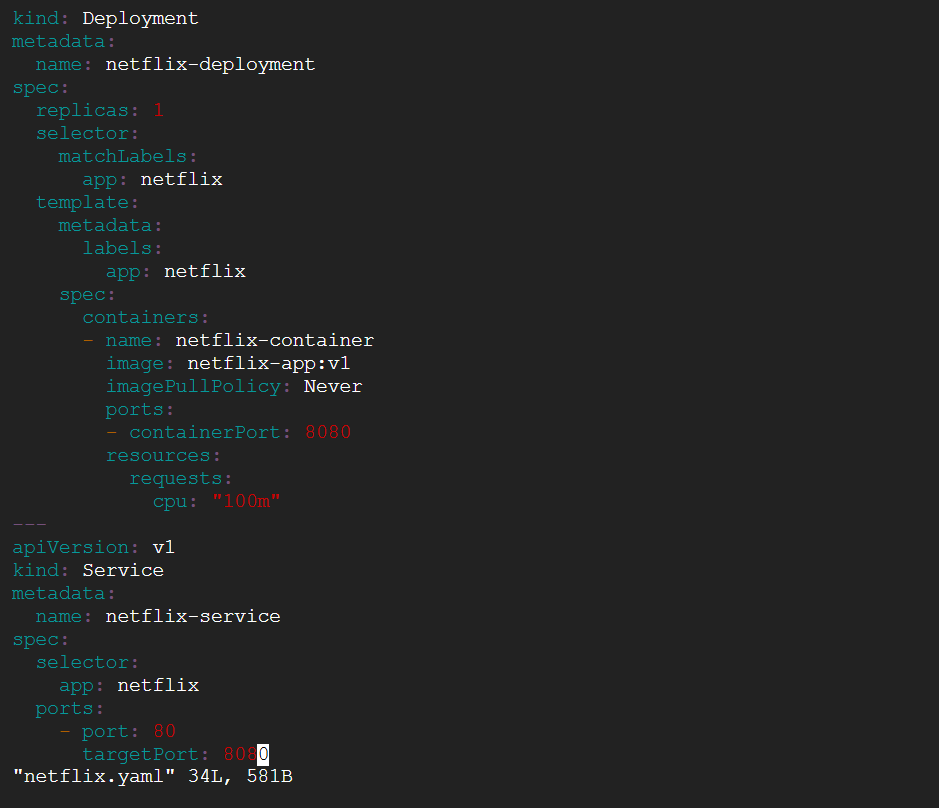
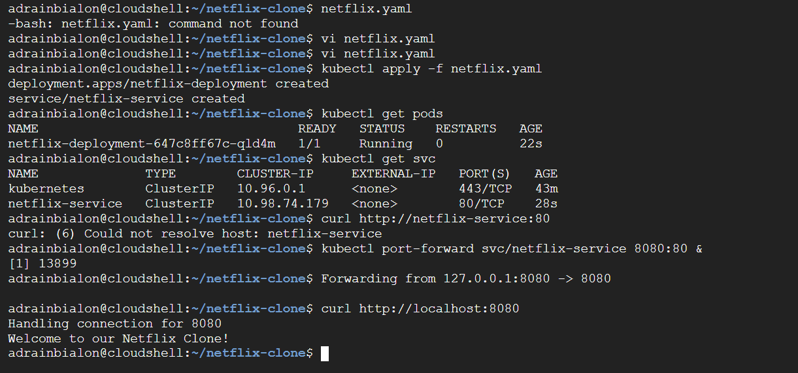
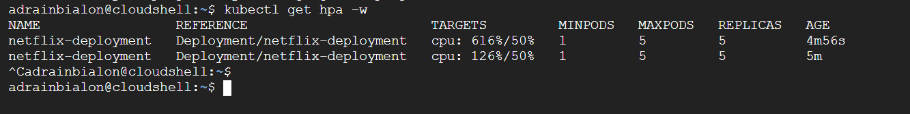
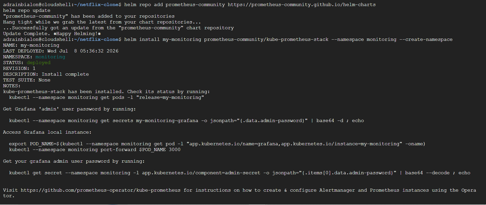
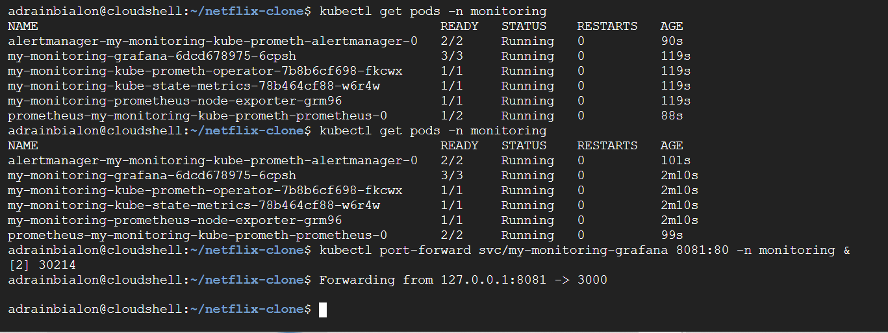

# Kubernetes Auto-Scaling Architecture (Netflix Clone)

## 📌 Project Overview
This project is an end-to-end DevOps System Design implementation simulating Netflix's auto-scaling architecture. It demonstrates how to containerize a Node.js application, deploy it to a Kubernetes cluster, and automatically scale the infrastructure to handle massive traffic spikes using the Horizontal Pod Autoscaler (HPA).

## 🏗️ System Architecture & Technologies Used
* **Application:** Node.js (Simulates heavy CPU load via a `/burn-cpu` endpoint).
* **Containerization:** Docker (Packaged the app into a lightweight Alpine Linux container).
* **Orchestration:** Kubernetes / Minikube (Manages the deployment, networking, and pods).
* **Auto-Scaling:** Kubernetes HPA (Monitors CPU utilization and scales pods dynamically from 1 to 5).
* **Observability:** Prometheus & Grafana (Helm chart deployment for real-time cluster monitoring).
* **Environment:** Google Cloud Shell.

## ⚙️ How It Works
1. **The App:** A custom Node.js server runs inside a Docker container. It has a specific route (`/burn-cpu`) designed to execute heavy mathematical calculations to simulate a sudden influx of users (e.g., a Friday night Netflix traffic spike).
2. **The Deployment:** The app is deployed to Kubernetes using a declarative YAML configuration, which includes a `Deployment` for pod management and a `Service` for internal networking.
3. **The Autoscaler:** The HPA is configured to watch the CPU metrics. If the CPU exceeds 50%, Kubernetes automatically provisions additional replica pods to distribute the load.
4. **The Result:** During load testing, the CPU spiked to over 600%, and Kubernetes successfully scaled the application horizontally to 5 pods to maintain system stability.

## 🚀 Steps to Reproduce
1. Start Minikube and enable metrics: `minikube start && minikube addons enable metrics-server`
2. Build the Docker image: `eval $(minikube docker-env) && docker build -t netflix-app:v1 .`
3. Apply the Kubernetes configuration: `kubectl apply -f netflix.yaml`
4. Create the Autoscaler: `kubectl autoscale deployment netflix-deployment --cpu-percent=50 --min=1 --max=5`
5. Simulate Traffic: `while true; do curl -s http://localhost:8080/burn-cpu > /dev/null; done &`
6. Watch the HPA scale the pods: `kubectl get hpa -w`

---

## 📸 Project Screenshots

*(Below is the visual proof of the infrastructure build, traffic simulation, and auto-scaling in action).*

**Step 1 & 2: Setup and Docker Build**

**Step 3: Kubernetes Deployment**

**Step 4: Configuring the Autoscaler (HPA)**

**Step 5: Simulating the Traffic Spike**

**Step 6: Auto-Scaling in Action**

**Step 7: System Verification**

